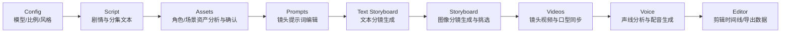
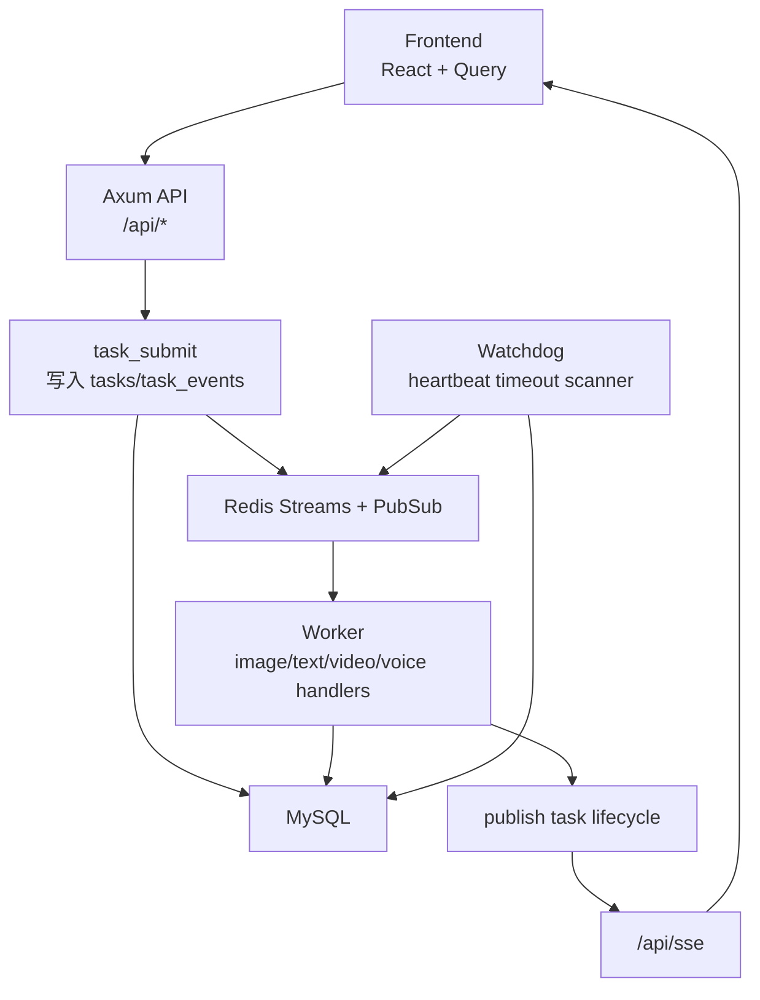

# Ally

Ally 是一个面向短视频内容生产的全栈系统，当前版本以 Rust 后端为核心实现，覆盖项目管理、小说改编、资产生产、视频与配音生成、编辑器落地与实时任务追踪。

## 功能特性总结

- 全链路内容生产：从原始文本到分镜、画面、视频、配音、最终编辑数据
- 前后端一体任务系统：任务提交、去重、实时 SSE 回传、失败兜底
- 双资产域模型：项目内资产（Novel Promotion）+ 全局资产库（Asset Hub）
- 媒体访问统一：支持 local/COS，两种模式下前端 URL 结构保持一致
- 可运营配置层：用户 API 配置、模型可用集、管理员 AI 配置管理

## Pipeline 图示

### 业务阶段 Pipeline（项目工作台）



### 后端运行时 Pipeline（任务执行链）



## 功能总览

### 1. 账号与认证
- 注册、登录、刷新 Token（JWT）
- `Authorization: Bearer` 与 HttpOnly Cookie 双通道认证
- 基于角色的管理员接口保护（如 AI 配置）

### 2. Workspace 项目工作台
- 项目列表分页、搜索、创建、编辑、删除
- 项目数据聚合（项目配置、分集、角色、场景等）
- 项目级资源汇总接口（供页面快速初始化）

### 3. Novel Promotion 流程（项目内生产链路）
- 项目级配置：分析模型、图片模型、视频模型、分辨率、比例、艺术风格等
- 分集管理：新增/编辑/删除、批量创建、按标记切分（`split-by-markers`）
- 脚本与分镜：剧情转脚本、脚本转分镜、分镜文本重生成、插入面板
- 资产联动：角色/场景维护、图片选择与回退、全局资产复制
- 视频与声音：视频生成、口型同步、声线分析、配音生成、Voice Line 管理
- 编辑器：每集编辑器数据读写（`editor`）
- 导出能力：项目图片/视频/音频 ZIP 下载
- 媒体代理：`video-proxy` 与 `/m/{publicId}` 媒体重定向

### 4. Asset Hub（全局资产中心）
- 文件夹（Folder）管理
- 角色资产管理（含多外观 appearance）
- 场景资产管理（含多图与选中状态）
- 音色资产管理与角色绑定
- 资产图上传、AI 生成/修改、引用图转角色（reference-to-character）

### 5. 用户与管理员配置
- 用户模型可用列表（按 provider 与类型分组）
- 用户 API 配置读写与连通性测试（OpenAI-compatible/Google 等）
- 用户偏好设置（默认模型、比例、风格等）
- 管理员 AI 模型与 Provider 全局配置（`/api/admin/ai-config`）

### 6. 任务系统与实时状态
- 统一任务提交与去重（dedupe key）
- 任务状态查询、取消、dismiss、target 状态聚合
- SSE 实时推送（历史回放 + 心跳 + Redis PubSub）
- Run 运行态接口（run/step/event）

### 7. 存储与媒体
- 本地存储（`STORAGE_TYPE=local`）与腾讯云 COS（`STORAGE_TYPE=cos`）
- `/api/files/{*path}` 本地文件安全访问（防穿越）
- `/api/cos/image` 与 `/api/cos/sign` 图片跳转兼容

## 前端页面能力

主要页面与能力：
- `/`：Landing
- `/auth/signin`、`/auth/signup`：登录/注册
- `/workspace`：项目列表与 CRUD
- `/workspace/:projectId`：项目生产工作台（9 阶段流）
- `/workspace/asset-hub`：全局资产中心
- `/profile`：用户资料/偏好
- `/admin/ai-config`：管理员 AI 配置页

前端技术栈：
- React 19 + React Router 7
- TanStack Query v5
- i18next（中英双语资源来自 `messages/`）
- TailwindCSS 4 + Vite 7

## 架构与目录

```text
ally/
├── crates/
│   ├── core/       # 共享能力：config/auth/db/errors/runtime/media/api_config...
│   ├── server/     # Axum API 服务
│   ├── worker/     # Redis Stream 消费与任务处理
│   └── watchdog/   # 任务超时扫描与重入队/失败标记
├── frontend/       # React SPA
├── migrations/     # SQL 迁移
├── scripts/        # 契约、运行时、性能、SSE、Worker 烟测脚本
└── deploy/         # systemd/nginx/docker/灰度模板
```

运行关系：
- `server` 提供 API、SSE、媒体路由
- `worker` 消费任务队列（image/text/video/voice）
- `watchdog` 兜底处理长时间无心跳任务

## 快速开始（本地）

### 0. 依赖准备
- Rust stable（Edition 2024）
- Node.js 20+
- MySQL 8.0
- Redis 7

可选：使用仓库内基础设施编排：
```bash
docker compose -f deploy/docker-compose.infra.yml up -d
```

### 1. 环境变量
```bash
cp .env.example .env
```

按实际环境调整重点变量：
- `DATABASE_URL`
- `REDIS_URL`
- `JWT_SECRET`（至少 32 字符）
- `CORS_ALLOW_ORIGIN`
- `STORAGE_TYPE`（`local` 或 `cos`）

### 2. 执行数据库迁移
项目当前使用手动 SQL 迁移：
```bash
mysql -u root -p waoowaoo < migrations/0001_initial.sql
mysql -u root -p waoowaoo < migrations/0002_run_runtime.sql
```

### 3. 启动后端三进程
```bash
# API
cargo run -p waoowaoo-server

# Worker（新终端）
cargo run -p waoowaoo-worker

# Watchdog（新终端）
cargo run -p waoowaoo-watchdog
```

### 4. 启动前端
```bash
cd frontend
npm install
npm run dev
```

默认开发地址：
- 前端：`http://127.0.0.1:45173`
- 后端：`http://127.0.0.1:43001`

前端 dev server 默认代理 `/api` 到 `VITE_DEV_API_PROXY_TARGET`（默认 `http://127.0.0.1:43001`）。

## 关键 API 分组

高频路由分组（节选）：
- 系统：`/healthz`、`/api/system/boot-id`
- 认证：`/api/auth/register`、`/api/auth/login`、`/api/auth/refresh`
- 用户：`/api/user/models`、`/api/user/api-config`、`/api/user-preference`
- 项目：`/api/projects`、`/api/projects/{id}`、`/api/projects/{id}/data`
- Novel：`/api/novel-promotion/{projectId}/...`（含 wildcard dispatch）
- Asset Hub：`/api/asset-hub/...`
- 任务：`/api/tasks`、`/api/task-target-states`
- Run：`/api/runs`、`/api/runs/{runId}/events`
- SSE：`/api/sse?projectId=...`
- 媒体：`/m/{publicId}`、`/api/files/{*path}`、`/api/cos/image`

## Worker 任务类型（核心）

按队列能力划分：
- image：`image_panel`、`image_character`、`image_location`、`panel_variant`、`asset_hub_image` 等
- text：`analyze_novel`、`story_to_script_run`、`script_to_storyboard_run`、`voice_analyze`、`insert_panel` 等
- video：`video_panel`、`lip_sync`
- voice：`voice_line`、`voice_design`、`asset_hub_voice_design`

默认并发（可通过环境变量覆盖）：
- `QUEUE_CONCURRENCY_IMAGE=20`
- `QUEUE_CONCURRENCY_TEXT=10`
- `QUEUE_CONCURRENCY_VIDEO=4`
- `QUEUE_CONCURRENCY_VOICE=10`

## 验证命令（提交前必须通过）

```bash
# Rust
cargo fmt
cargo check --workspace
cargo clippy --workspace --all-targets
cargo test --workspace

# Frontend
cd frontend && npx tsc --noEmit
cd frontend && npm run build
```

## 回归与联调脚本

```bash
# 静态契约回归（legacy route source vs rust route source）
node scripts/api-contract-regression.mjs

# 运行时契约对比（先 dry-run 验证 case 文件）
node scripts/api-runtime-compare.mjs --dry-run

# 运行时双端对比（legacy + rust）
node scripts/api-runtime-compare.mjs \
  --legacy-base http://127.0.0.1:3000 \
  --rust-base http://127.0.0.1:43001 \
  --token "<jwt>" \
  --cases scripts/api-runtime-cases.sample.json

# SSE / Worker 烟测
node scripts/sse-reconnect-smoke.mjs --base http://127.0.0.1:43001 --project-id "<project-id>"
node scripts/worker-runtime-smoke.mjs --base http://127.0.0.1:43001
```

## 部署概览（jpdata）

生产部署目标与模板位于 `deploy/`：
- `deploy/docker-compose.infra.yml`：MySQL + Redis
- `deploy/ally-*.service`：systemd 进程管理
- `deploy/nginx-ally.conf`：Nginx 反向代理
- `deploy/deploy.sh`：一键部署脚本

## 范围说明

- 本仓库当前对齐范围为核心生产流程与管理能力。
- 计费相关能力已按迁移策略移除，不在当前实现范围内。
